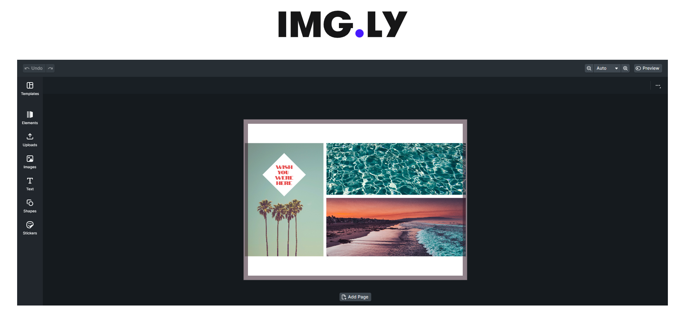

# Getting Started and testing with img.ly SDK enviroment

This project was bootstrapped and cleared out to the basics [Create React App](https://github.com/facebook/create-react-app).

## One Simple Script to run and test.

In the project directory, you can run:

### `npm start`

Runs the app in the development mode.\
Open [http://localhost:3000](http://localhost:3000) to view it in your browser once you have installed node_modules.

## Learn More with Img.ly and their React integrations

[Integrate Creative Editor](https://img.ly/docs/cesdk/ui/quickstart?framework=react)

### Img.ly Example Intergration

